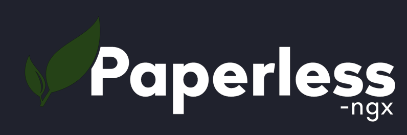

# Paperless on Proxmox

<p align="center">
    
    
    
</p>

Create a [ProxMox](https://www.proxmox.com/en/) LXC running Ubuntu and [Paperless](https://github.com/paperless-ngx/paperless-ngx) on [Docker](https://www.docker.com/).

Tested on ProxMox v8, Docker 20.10, Paperless 1.17.4.

## Usage

SSH to your ProxMox server as a privileged user and run...

```shell
bash -c "$(wget --no-cache -qLO - https://raw.githubusercontent.com/noofny/proxmox_paperless/master/setup.sh)"
```
